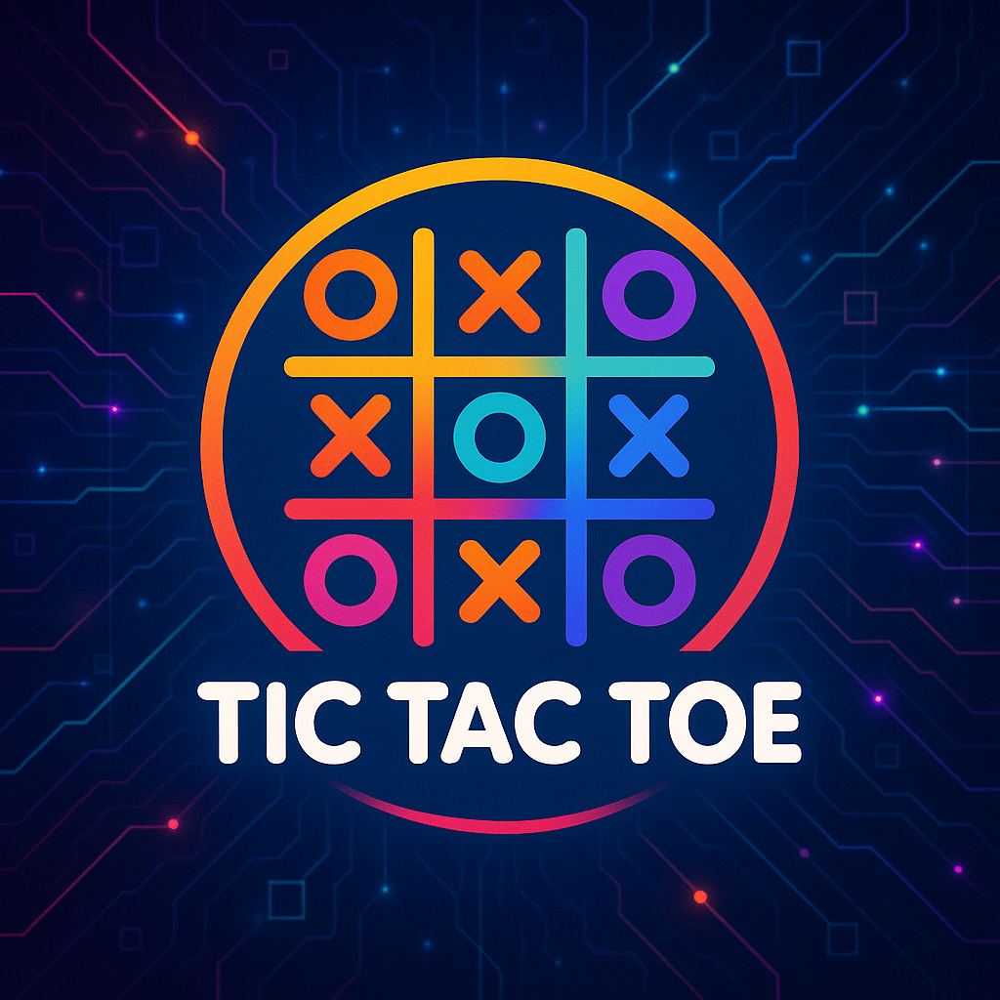

  

<h2 align="center">A Simple yet fully decentralized two-player Tic Tac Toe game built on smart contracts with a modern frontend. Play, win, earn — all on-chain.</h2>

  
  
  
  
  
  
  

## 🧠 Features

### Smart Contracts (Foundry)

- Players can **create**, **join**, **play**, and **cancel** games.
- Games have **entry bets**, and winnings are distributed automatically.
- Supports **timeouts**: inactive players can be forfeited after 10 minutes.
- **Leaderboard tracking**: wins, losses, draws.
- All logic and funds are handled by the contract.
- Dev fee management + withdrawal by owner.

### Frontend (Next.js + Wagmi)

- In Progress